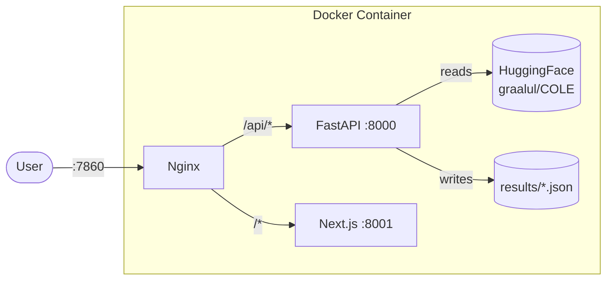
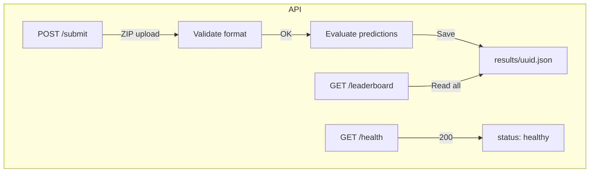
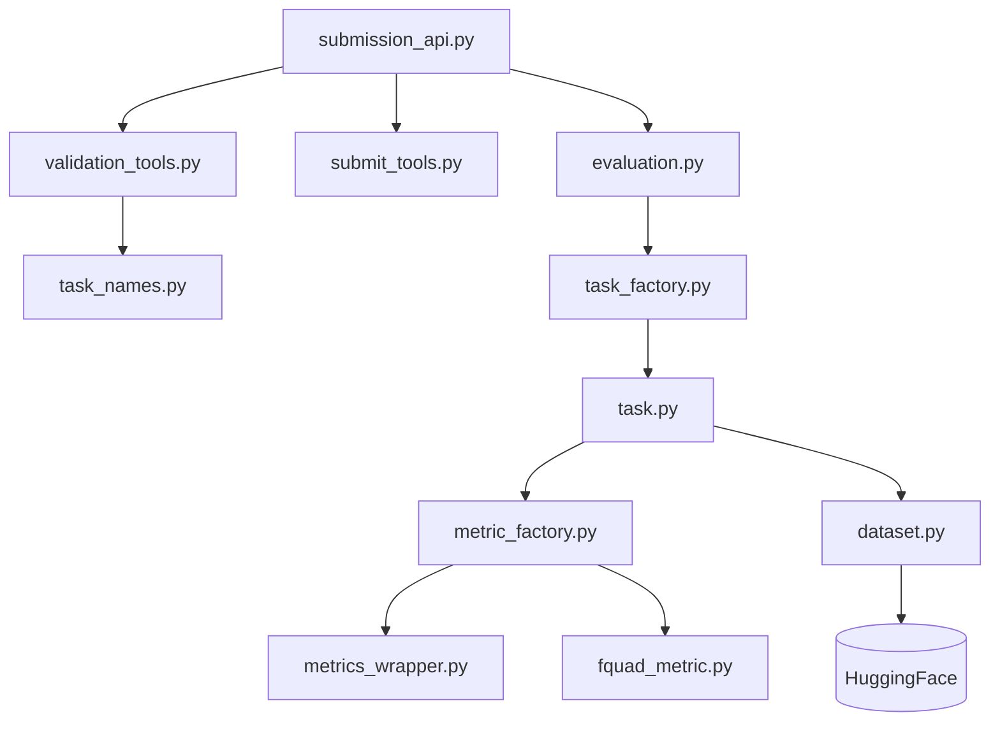
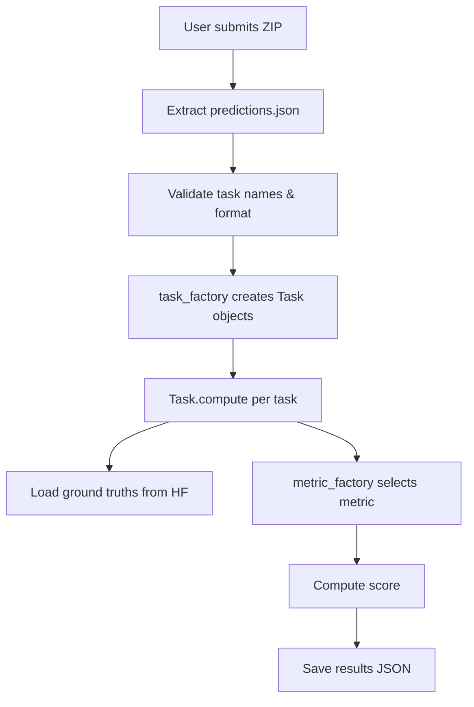
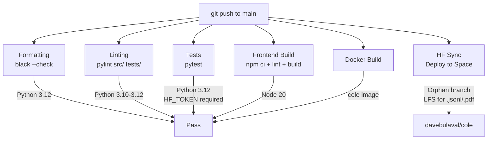

# COLE Architecture

## System Overview

COLE runs as a single Docker container with three services behind an nginx reverse proxy, deployed on HuggingFace Spaces.



## Backend (FastAPI)

### API Endpoints



| Endpoint | Method | Description |
|----------|--------|-------------|
| `/submit` | POST | Upload predictions ZIP, evaluate, save results |
| `/leaderboard` | GET | Return all submissions with metrics |
| `/health` | GET | Health check |

### Security

- **Rate limiting**: 5 submissions/minute per IP (slowapi)
- **ZIP validation**: Max 50MB compressed, 200MB decompressed
- **Input validation**: Email (max 320 chars, must contain @), display name (max 200 chars)
- **CORS**: Open origins (proxied through nginx)

### Key Modules



## Frontend (Next.js)

### Pages

```mermaid
graph LR
    subgraph Pages
        Home[/ Home]
        Guide[/guide]
        FAQ[/FAQ]
        Contact[/contact]
        Papers[/papers]
        Benchmarks[/benchmarks]
        Leaderboard[/leaderboard]
        Results[/results/id]
    end
    subgraph Features
        i18n[EN/FR i18n]
        Responsive[Mobile responsive]
        Pagination[Leaderboard pagination]
        Submit[ZIP submission modal]
    end
```

| Page | Description |
|------|-------------|
| `/` | What is COLE, links to paper and GLUE/SuperGLUE |
| `/guide` | How to train, test, and format submissions |
| `/FAQ` | 6 questions with code formatting support |
| `/benchmarks` | 23 tasks organized by 9 NLU categories |
| `/leaderboard` | Sortable table, 25/page, loading skeleton, error states |
| `/papers` | Embedded arxiv PDF viewer |
| `/results/[id]` | Per-submission detailed results |
| `/contact` | Email contact |

### i18n

Full English and French translations in `frontend/src/app/en/translation.json` and `fr/translation.json`. Language switcher in the header persists selection to localStorage.

## Evaluation Pipeline

### Task Flow



### Tasks (23 total)

Grouped by capability:

| Category | Tasks |
|----------|-------|
| Sentiment | allocine, mms |
| NLI | daccord, fracas, gqnli, lingnli, mnli-nineeleven-fr-mt, rte3-french, sickfr, xnli |
| QA | fquad, french_boolq, piaf |
| Paraphrase | paws_x, qfrblimp |
| Grammar | multiblimp, qfrcola |
| Similarity | sts22 |
| WSD | wsd |
| Quebec French | qfrcore, qfrcort |
| Coreference | wino_x_lm, wino_x_mt |

### Metrics

| Metric | Implementation | Used by |
|--------|---------------|---------|
| Accuracy | HuggingFace `evaluate` | Most classification tasks |
| Pearson | HuggingFace `evaluate` | sickfr, sts22 |
| FQuAD | Custom (F1 + Exact Match) | fquad, piaf |
| ExactMatch | Custom string comparison | wsd |
| F1 | HuggingFace `evaluate` | Classification variants |

## CI/CD Pipeline



## Deployment

The HF Space deployment uses an orphan branch strategy to handle large `.jsonl` files in git history:

1. Checkout main with LFS
2. Create fresh orphan branch
3. Track `.jsonl` and `.pdf` with Git LFS
4. Remove CI/test files not needed in production
5. Force push to `davebulaval/cole` Space

The Space builds the Docker image and runs the container with nginx on port 7860.
